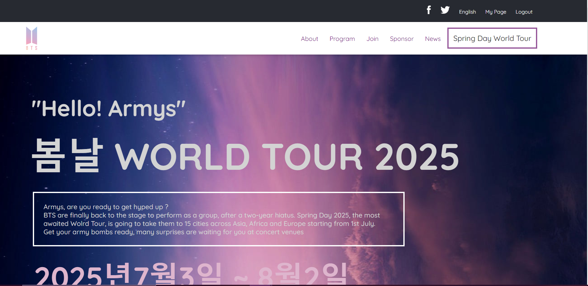

# Capstone-Project1

  <h3><b>Capstone Project 1</b></h3>

# 📗 Table of Contents

- [📖 About the Project](#about-project)
  - [🛠 Built With](#built-with)
    - [Tech Stack](#tech-stack)
    - [Key Features](#key-features)
  - [🚀 Live Demo](#live-demo)  
- [💻 Getting Started](#getting-started)
  - [Install](#install)
- [👥 Authors](#authors)
- [🔭 Future Features](#future-features)
- [🤝 Contributing](#contributing)
- [🙏 Acknowledgements](#acknowledgements)
- [⭐️ Show your support](#support)
- [📝 License](#license)

<!-- PROJECT DESCRIPTION -->

# 📖 [Capstone_Project1] 

> This capstone project was built for Microverse [under these guidance objectives](https://github.com/microverseinc/curriculum-html-css/blob/main/capstone/html_capstone.md) > _note: you can only access this link if you're a Micronault (Microverse Student)_

**[Capstone_Project1]** is about building a concert website, based on an online website for a conference.

>   Here, you will find a short [video presentation](https://www.loom.com/share/20aa7b4a49c84ca691816a0d36e820f3), describing the project.

## 🛠 Built With 
- HTML
- CSS
- JAVASCRIPT

### Tech Stack 
Linters

  
Linters

  
Client

  <ul>
    <li><a>HTML</a></li>
    <li><a>CSS</a></li>
    <li><a>JavaScript</a></li>
  </ul>

(<a href="#readme-top">back to top</a>)

### Key Features 

- **No linter errors**
- **Using of correct GitHub flow**
- **Documenting in a professional way**
- **Following best practices for HTML and CSS**
- **Creating Header and Headline section**

(<a href="#readme-top">back to top</a>)

## 🚀 Live Demo 

- [Live Demo Link](https://aima98.github.io/Capstone-Project1/)

(<a href="#readme-top">back to top</a>)

## 💻 Getting Started 

To get a local copy up and running, follow these steps.

### Prerequisites

In order to run this project you need:

- **Visual Studio Code**
- **Git Bash**

### Setup

Clone this repository to your desired folder:
- **cd your-folder**
- **git clone https://github.com/aima98/Capstone-Project1**

(<a href="#readme-top">back to top</a>)

<!-- AUTHORS -->

## 👥 Authors 

👤 **Oumaima Nejjari**

- GitHub: [@aima98](https://github.com/aima98)
- Twitter: [@NejjariOumaima](https://twitter.com/NejjariOumaima?t=RtmpuP_lmHYVD3EiP4AeMg&s=03)
- LinkedIn: [Oumaima Nejjari](https://www.linkedin.com/in/oumaima-nejjari-375065171/)

(<a href="#readme-top">back to top</a>)

## 🔭 Future Features 

- **Building more websites**

(<a href="#readme-top">back to top</a>)

<!-- CONTRIBUTING -->

## 🤝 Contributing 

Contributions, issues, and feature requests are welcome!

(<a href="#readme-top">back to top</a>)

<!-- ACKNOWLEDGEMENTS -->

## 🙏 Acknowledgments 

I would like to thank all of my Microverse mates and mentors for their support.

- Original Design idea by [Cindy Shin in Behance](https://www.behance.net/adagio07).

## Show your support

Give a ⭐️ if you like this project!

(<a href="#readme-top">back to top</a>)

## ⭐️ Show your support 

If you like this project, give it a ⭐️ ! 
Feel comfortable to endorse the author. You can contact the author via Twitter or Linkedin or directly message at oumanj1998@gmail.com.

(<a href="#readme-top">back to top</a>)

<!-- LICENSE -->

## 📝 License 

This project is [MIT](./LICENSE) licensed.

(<a href="#readme-top">back to top</a>)
